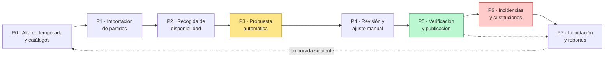
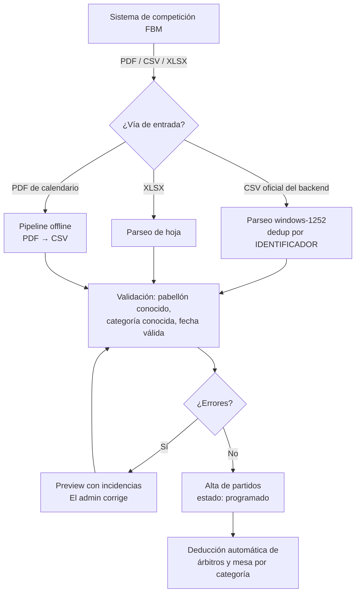
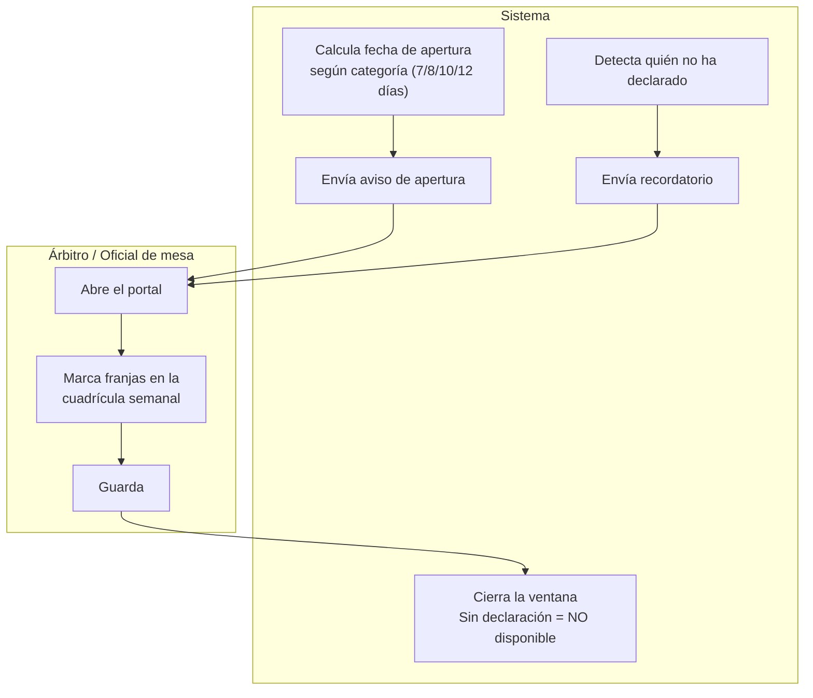
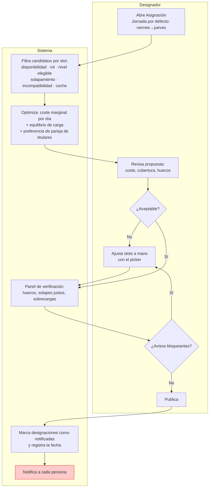
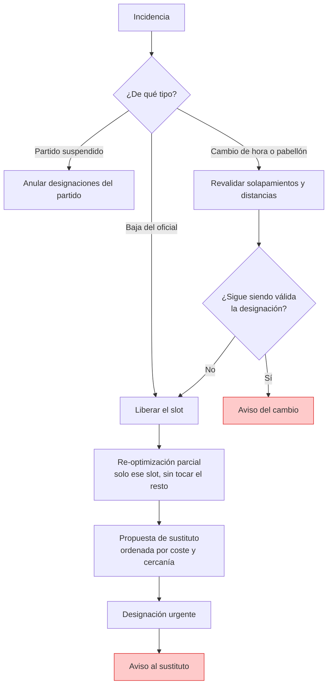

# Flujo de procesos — Sistema de Designaciones FBM (TO-BE)

**Versión**: 1.0 · **Fecha**: 2026-07-25 · **Ámbito**: ciclo completo de designación de árbitros y
oficiales de mesa de la Federación de Baloncesto de Madrid.

## Cómo leer este documento

Describe el proceso **TO-BE**: cómo funciona el ciclo con el sistema en marcha. Cada paso indica quién
lo ejecuta, qué regla lo gobierna y **en qué estado está hoy la implementación**, con el fichero donde
vive. No es una propuesta teórica: la mayoría de las reglas están implementadas y verificadas contra el
calendario real de la temporada 2025/2026 (24.508 partidos, 1.279 personas).

| Símbolo | Significado                                                                 |
| ------- | --------------------------------------------------------------------------- |
| ✅      | Implementado y verificado con datos reales                                  |
| 🟡      | Implementado parcialmente o con sustituto provisional (mock, dato simulado) |
| ⬜      | No construido todavía                                                       |

**Aviso sobre un dato clave**: la disponibilidad de los oficiales es hoy **simulada por arquetipos**,
no declarada por personas reales. Todas las métricas de cobertura de este documento se apoyan en ese
supuesto y deben reconfirmarse con disponibilidad real antes de tomar decisiones de plantilla.

---

## 1. Actores

| Actor                         | Quién es                              | Qué hace en el proceso                                                   |
| ----------------------------- | ------------------------------------- | ------------------------------------------------------------------------ |
| **Árbitro / Oficial de mesa** | ~1.279 personas, actividad secundaria | Declara disponibilidad, consulta sus designaciones, comunica incidencias |
| **Designador**                | Responsable del comité de árbitros    | Lanza la designación, revisa la propuesta, ajusta, publica               |
| **Admin FBM**                 | Personal de la federación             | Mantiene personal, competiciones, pabellones y parámetros del sistema    |
| **Tesorería FBM**             | Departamento financiero               | Recibe la liquidación mensual y ejecuta los pagos                        |
| **Sistema**                   | La aplicación                         | Calcula, valida, propone, notifica y agrega                              |
| **Sistema de competición**    | Backend de competición FBM (externo)  | Origen de los partidos de cada jornada                                   |

**Unidad de trabajo**: la **jornada FBM**, que va de **viernes a jueves**. Se designa **semana a
semana**, nunca la temporada completa de golpe. Una jornada mezcla ~48 competiciones distintas, así
que la ventana se calcula siempre por **fechas**, nunca por número de jornada de una competición.

---

## 2. Mapa de nivel 0 — cadena de valor

P0 ocurre una vez por temporada. P1 a P7 se repiten **cada semana**, 29 veces por temporada.

---

## 3. Calendario semanal de una jornada

| Momento             | Qué ocurre                                                  | Quién      | Estado |
| ------------------- | ----------------------------------------------------------- | ---------- | ------ |
| J-12 a J-7 días     | Se abre la ventana de disponibilidad según categoría        | Sistema    | 🟡     |
| J-7 / J-5           | Recordatorio a quien no ha declarado                        | Sistema    | 🟡     |
| J-5                 | Cierre de disponibilidad (quien no declara = no disponible) | Sistema    | ✅     |
| J-4                 | El designador lanza la propuesta automática                 | Designador | ✅     |
| J-4 / J-3           | Revisión, ajustes manuales y verificación                   | Designador | ✅     |
| J-3                 | Publicación de designaciones                                | Designador | 🟡     |
| J-3 a J-0           | Incidencias y sustituciones                                 | Designador | ⬜     |
| Viernes a jueves    | Se disputan los partidos                                    | —          | —      |
| Mes natural cerrado | Liquidación y envío a tesorería                             | Designador | ✅     |

El plazo de apertura **depende de la categoría**, porque las categorías altas necesitan más antelación
(`lib/availability-deadline.ts`): provincial 7 días, autonómico 8, nacional 10, FEB 12. Categoría
desconocida se trata como 12, el más restrictivo.

---

## 4. P0 · Alta de temporada y catálogos

| #   | Paso                                                          | Actor     | Estado | Dónde vive                               |
| --- | ------------------------------------------------------------- | --------- | ------ | ---------------------------------------- |
| 1   | Crear temporada y competiciones con sus requisitos            | Admin FBM | 🟡     | `lib/fbm-calendar/bases-fbm.ts`          |
| 2   | Alta de pabellones con dirección y coordenadas                | Admin FBM | ✅     | `lib/data/venue-coords.json`             |
| 3   | Alta de personal: rol, nivel arbitral, dirección, coche, IBAN | Admin FBM | ✅     | `/api/admin/persons`                     |
| 4   | Declarar incompatibilidades (club propio)                     | Admin FBM | 🟡     | modelo previsto, sin UI de gestión       |
| 5   | Generar matriz de distancias entre municipios                 | Sistema   | ✅     | `lib/geo-distance.ts` (haversine × 1,3)  |
| 6   | Fijar parámetros: tarifa/km, fijos por día, cap de carga      | Admin FBM | 🟡     | hoy en código, no en UI de configuración |

**Regla de negocio**: el número de árbitros y oficiales de mesa **no lo decide el designador**, sale de
la Tabla A de las Bases Generales FBM según la categoría del partido (22 filas verificadas).

---

## 5. P1 · Importación de partidos

| #   | Paso                                          | Actor     | Estado | Dónde vive                                                   |
| --- | --------------------------------------------- | --------- | ------ | ------------------------------------------------------------ |
| 1   | Subida del fichero de la jornada              | Admin FBM | ✅     | `/api/admin/matches/import-csv-fbm`, `import-xlsx`, `import` |
| 2   | Validación y preview antes de confirmar       | Sistema   | ✅     | mismas rutas                                                 |
| 3   | Deducción de plantilla arbitral por categoría | Sistema   | ✅     | `lib/fbm-calendar/bases-fbm.ts`                              |
| 4   | Sincronización automática con la FBM          | Sistema   | ⬜     | Fase 6 del roadmap                                           |

**Nota de dominio**: no se hace scraping de fbm.es (su `robots.txt` lo prohíbe). La entrada es el CSV
oficial del backend de competición o el pipeline offline desde los PDF de calendario.

---

## 6. P2 · Recogida de disponibilidad

| #   | Paso                                                | Actor      | Estado | Dónde vive                                         |
| --- | --------------------------------------------------- | ---------- | ------ | -------------------------------------------------- |
| 1   | Cálculo de la ventana por categoría                 | Sistema    | ✅     | `lib/availability-deadline.ts`                     |
| 2   | Aviso de apertura por email                         | Sistema    | 🟡     | `/api/admin/alerts` es manual, no automático       |
| 3   | Declaración de franjas en el portal                 | Oficial    | ✅     | `(portal)/disponibilidad`                          |
| 4   | Recordatorio a los que faltan                       | Designador | 🟡     | `/api/admin/alerts` con filtro por rol y categoría |
| 5   | Cierre: sin declaración se interpreta no disponible | Sistema    | ✅     | `lib/matchday-availability.ts`                     |
| 6   | Notificación push                                   | Sistema    | ⬜     | Fase 5 del roadmap                                 |

**Estado del envío de email**: hay integración real con Resend (`/api/admin/alerts`), pero **se dispara
a mano** desde el panel y sin clave configurada solo escribe en consola. El disparo automático por
calendario (cron) es la pieza que falta.

**Este es hoy el principal cuello de botella del sistema**: en la simulación, el motivo dominante de
los huecos de cobertura es "sin disponibilidad declarada" (entre 350 y 580 personas descartadas por
slot), muy por encima de la carga máxima o del nivel arbitral.

---

## 7. P3 a P5 · Designación: propuesta, ajuste y publicación (núcleo del sistema)

| #   | Paso                                                   | Actor      | Estado | Dónde vive                                     |
| --- | ------------------------------------------------------ | ---------- | ------ | ---------------------------------------------- |
| 1   | Acotar a la jornada (viernes→jueves) por defecto       | Sistema    | ✅     | `/api/optimize` + `match-query.ts`             |
| 2   | Filtrado duro de candidatos por slot                   | Sistema    | ✅     | `lib/solver.ts`                                |
| 3   | Optimización coste + equilibrio de carga               | Sistema    | ✅     | `lib/solver.ts`                                |
| 4   | Generar hasta 5 propuestas alternativas                | Sistema    | ✅     | `/api/optimize`                                |
| 5   | Ajuste manual slot a slot con coste y carga a la vista | Designador | ✅     | `/api/admin/picker`                            |
| 6   | Panel de verificación previo a publicar                | Sistema    | ✅     | `lib/schedule-conflicts.ts`                    |
| 7   | Publicación: cambia estado a notificado                | Designador | ✅     | `/api/admin/designations/publish`              |
| 8   | **Envío efectivo del aviso a cada persona**            | Sistema    | ⬜     | **hueco: publicar no envía nada**              |
| 9   | Confirmación de la designación por el oficial          | Oficial    | 🟡     | existe el estado; en la práctica no se rechaza |

### Reglas que gobiernan las decisiones del paso 2 y 3

| Regla               | Contenido                                                                                                         | Tipo        | Dónde vive                   |
| ------------------- | ----------------------------------------------------------------------------------------------------------------- | ----------- | ---------------------------- |
| Cobertura           | Cada partido necesita N árbitros y M de mesa según la Tabla A de las Bases                                        | Duro        | `bases-fbm.ts`               |
| Disponibilidad      | Solo se asigna a quien declaró esa franja                                                                         | Duro        | `mock-data.ts`               |
| Elegibilidad        | Matriz de 7 niveles arbitrales por categoría fina y por rol del slot (principal/auxiliar)                         | Duro        | `referee-eligibility.ts`     |
| Carga máxima        | 3 partidos **por franja**, no por jornada. Franjas: sáb mañana/tarde, dom mañana/tarde, entresemana (corte 15:00) | Duro        | `solver.ts`                  |
| Separación mínima   | Entre inicios: 1:30 mismo pabellón (1:45 deseable), 2:00 mismo municipio, 2:30 municipios distintos               | Duro + soft | `overlap.ts`                 |
| Suelo de viaje      | Si el viaje estimado + 30 min supera la separación mínima, manda el viaje                                         | Duro        | `overlap.ts`                 |
| Coche               | Sin coche y más de 30 km: descartado. Entre 15 y 30 km: penalización                                              | Duro + soft | `solver.ts`                  |
| Incompatibilidad    | No se pita a un partido del club propio                                                                           | Duro        | modelo previsto              |
| Coste               | Se minimiza el **coste marginal por persona y día**, no por partido                                               | Objetivo    | `mock-data.ts` + `solver.ts` |
| Pareja de titulares | En el slot auxiliar se prefiere un nivel que también sea titular de esa categoría (equivale a 10 €)               | Soft        | `solver.ts`                  |

### Rendimiento medido (2026-07-25, mediana de 3 corridas)

| Métrica                                     | Valor                                   |
| ------------------------------------------- | --------------------------------------- |
| Jornada punta (1.309 partidos, 3.686 slots) | 18,2 s (rango 5,8 - 22,3 s)             |
| Jornada más lenta observada                 | 24,6 s, por debajo del objetivo de 30 s |
| Temporada completa, jornada a jornada       | 198 s (rango 124 - 305 s)               |
| Cobertura ponderada de la temporada         | 86,8 % con disponibilidad simulada      |

El motor es un **greedy en TypeScript**, no un solver de programación entera. El microservicio Python
con OR-Tools sigue siendo una opción abierta si se quiere subir la cobertura en jornadas punta.

---

## 8. P6 · Incidencias y sustituciones

| #   | Paso                                        | Actor      | Estado | Nota                                    |
| --- | ------------------------------------------- | ---------- | ------ | --------------------------------------- |
| 1   | Registrar la incidencia                     | Designador | ⬜     | hoy se resuelve fuera del sistema       |
| 2   | Re-optimización parcial de un solo slot     | Sistema    | ✅     | `/api/optimize` con `partial`           |
| 3   | Propuesta ordenada de sustitutos            | Sistema    | ✅     | misma ruta                              |
| 4   | Aviso urgente al sustituto                  | Sistema    | ⬜     | depende del hueco de notificaciones     |
| 5   | Revalidación tras cambio de hora o pabellón | Sistema    | ⬜     | las reglas existen, falta el disparador |

**El motor de sustitución ya está construido**; lo que falta es el circuito alrededor: registrar la
incidencia, disparar el recálculo y avisar. Nota de dominio confirmada: en la operativa real los
árbitros **no rechazan** designaciones, así que no hay que construir un flujo de rechazo.

---

## 9. P7 · Liquidación y reportes

| #   | Paso                                            | Actor      | Estado | Dónde vive                     |
| --- | ----------------------------------------------- | ---------- | ------ | ------------------------------ |
| 1   | Agregar coste por persona y día del mes natural | Sistema    | ✅     | `/api/admin/reports`           |
| 2   | Sumar honorarios por categoría de partido y rol | Sistema    | ✅     | tarifas oficiales de las Bases |
| 3   | Revisar la liquidación antes de enviarla        | Designador | ✅     | `(admin)/reportes`             |
| 4   | Exportar a XLSX para tesorería                  | Designador | ✅     | `lib/export-xlsx.ts`           |
| 5   | Exportar justificante en PDF por persona        | Designador | ✅     | `lib/export-pdf.ts`            |
| 6   | Consulta de historial por el propio oficial     | Oficial    | ✅     | `(portal)/perfil`              |
| 7   | Ejecutar el pago                                | Tesorería  | ⬜     | fuera del sistema              |

**Invariante verificado**: el total de una persona coincide al céntimo en portal, panel de admin y
reportes. El coste de desplazamiento es **por persona y día**: un día con salida a otro municipio paga
solo kilometraje (0,26 €/km, un trayecto por municipio de destino distinto), y un día íntegro en el
municipio propio paga un fijo diario (3 € en Madrid capital, 2 € en el resto), sin importar cuántos
partidos haya ese día.

---

## 10. Proceso transversal: identidad y permisos

| Capacidad                              | Estado | Nota                                                               |
| -------------------------------------- | ------ | ------------------------------------------------------------------ |
| Acceso sin contraseña (magic link)     | 🟡     | Supabase Auth integrado en el middleware, sin credenciales activas |
| Separación de vistas portal / admin    | ✅     | rutas `(portal)` y `(admin)`                                       |
| Protección efectiva por rol            | ⬜     | **sin credenciales el middleware deja pasar todo**                 |
| Registro de auditoría de quién designó | ⬜     | Fase 7 del roadmap                                                 |
| Persistencia en base de datos          | 🟡     | hoy fichero JSON en memoria de proceso, no PostgreSQL              |

Este bloque es el de mayor distancia entre lo diseñado y lo operativo, y es requisito para producción:
sin control de acceso real no se puede exponer el portal a 1.279 personas ni manejar IBAN.

---

## 11. Estado consolidado

| Macroproceso                     | Estado | Comentario                                                        |
| -------------------------------- | ------ | ----------------------------------------------------------------- |
| P0 Alta de temporada y catálogos | 🟡     | Datos y reglas sí; falta UI de configuración e incompatibilidades |
| P1 Importación de partidos       | ✅     | Tres vías de entrada, con validación y preview                    |
| P2 Recogida de disponibilidad    | 🟡     | Portal completo; faltan los disparadores automáticos              |
| P3 Propuesta automática          | ✅     | Verificado sobre la temporada real completa                       |
| P4 Revisión y ajuste manual      | ✅     | Picker con coste, carga y disponibilidad a la vista               |
| P5 Verificación y publicación    | 🟡     | Verifica y publica, **pero no notifica**                          |
| P6 Incidencias y sustituciones   | 🟡     | Motor construido, circuito no                                     |
| P7 Liquidación y reportes        | ✅     | Reconciliado al céntimo, exportable                               |
| Identidad y permisos             | ⬜     | Requisito bloqueante para producción                              |

**Los tres huecos que separan esto de un piloto real**, en orden de bloqueo:

1. **Control de acceso efectivo** (nadie puede ver los datos de otro).
2. **Notificaciones**: publicar debe avisar a cada persona, y la disponibilidad debe pedirse sola.
3. **Persistencia real en base de datos** en lugar de fichero en memoria de proceso.

---

## 12. Preguntas abiertas para la FBM y para Gesdep

Estas son las decisiones que un flujo de procesos debe cerrar y que hoy están abiertas. Conviene
contrastarlas con el documento de Gesdep, porque son la fuente habitual de sobrecoste:

1. **Bajas de última hora**: ¿quién las recibe y por qué canal? ¿Hay un plazo a partir del cual ya no
   se sustituye?
2. **Partidos suspendidos o aplazados**: ¿se anulan las designaciones y se vuelve a designar, o se
   arrastran a la nueva fecha? ¿Se paga algo al oficial que ya se había desplazado?
3. **Confirmación de designación**: ¿se exige acuse de recibo con valor formal, o basta con la
   publicación? En la práctica actual los árbitros no rechazan.
4. **Incompatibilidades**: ¿las declara el propio árbitro o las mantiene la FBM? ¿Alcanzan solo al club
   propio o también a familiares y a clubes donde entrena?
5. **Ciclo de liquidación**: ¿mes natural? ¿Quién valida antes de tesorería y con qué plazo de pago?
6. **Integración con competición**: ¿la FBM puede dar acceso a una API, o el circuito seguirá siendo el
   CSV oficial? Esto decide si P1 llega a automatizarse del todo.
7. **Altas y bajas de personal**: ¿con qué periodicidad cambian los niveles arbitrales y quién lo
   comunica?
8. **Protección de datos**: el sistema maneja dirección postal e IBAN. ¿Quién puede verlos, cuánto
   tiempo se conservan y qué figura en el registro de tratamiento?
9. **Franjas y carga**: ¿el máximo de 3 por franja es política estable o se negocia por categoría?
10. **Disponibilidad**: ¿es obligatorio declararla? Hoy no declarar equivale a no estar disponible, y es
    el principal limitador de cobertura del sistema.
